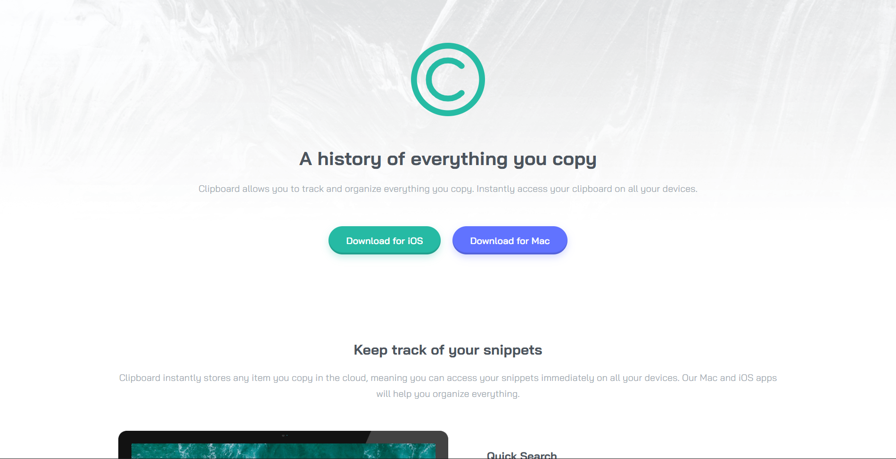

# Frontend Mentor - Clipboard landing page solution

This is a solution to the [Clipboard landing page challenge on Frontend Mentor](https://www.frontendmentor.io/challenges/clipboard-landing-page-5cc9bccd6c4c91111378ecb9). Frontend Mentor challenges help you improve your coding skills by building realistic projects.

## Table of contents

- [Overview](#overview)
  - [The challenge](#the-challenge)
  - [Screenshot](#screenshot)
  - [Links](#links)
- [My process](#my-process)
  - [Built with](#built-with)
  - [What I learned](#what-i-learned)
  - [Continued development](#continued-development)
  - [AI Collaboration](#ai-collaboration)
- [Author](#author)

## Overview

### The challenge

Users should be able to:

- View the optimal layout for the site depending on their device's screen size
- See hover states for all interactive elements on the page

### Screenshot



### Links

- Solution URL: [GitHub Repository](https://github.com/belal-elkholy-dev/clipboard-landing-page-master)
- Live Site URL: [Vercel Live Site](https://clipboard-landing-page-master-fawn.vercel.app/)

## My process

### Built with

- Semantic HTML5 markup
- CSS custom properties (Advanced HSL handling)
- Flexbox
- CSS Grid (Advanced `auto-fill` and `minmax` techniques)
- Mobile-first workflow
- **Custom CSS Architecture**: Separated logic into `normalize.css`, `framework.css` (for reusable utility classes), and `master.css` (for layout-specific styles) to build a scalable design system without external libraries.

### What I learned

This project was a massive leap in my understanding of **Clean Code** and **CSS Architecture**. Instead of just making the layout look like the design, I focused on building a scalable, maintainable codebase.

Here are some of the major techniques I implemented:

**1. Advanced CSS Variables (HSL Trick):**
To avoid hardcoding colors for hover states and box-shadows with different opacities, I stored only the HSL values in variables. This allowed me to dynamically apply alpha transparency later:

```css
:root {
  --c-ios-val: 171deg 66% 44%;
}

.ios {
  /* Using the variable with an alpha channel for the shadow */
  box-shadow: 0 5px 12px 0px hsl(var(--c-ios-val) / 25%);
}

.download-actions .ios:hover {
  /* Reusing the exact same variable with a different opacity for hover */
  background-color: hsl(var(--c-ios-val) / 70%);
}
```

**2. Avoiding the `100vh` Mobile Trap:**
I learned why forcing `height: 100vh` on the Hero section is a bad practice for mobile devices (due to content overflow and browser UI bars). Instead, I relied on structured padding (`padding: 4.625rem 0`) to allow the section to breathe naturally based on its content.

**3. Responsive Images Mastery:**
I solidified my understanding of image constraints, specifically preferring `max-width: 100%` over `width: 100%` to ensure images scale down perfectly on mobile but never stretch beyond their original resolution on large desktop screens.

**4. CSS Grid without Media Queries:**
Achieved a fully responsive features grid utilizing `minmax`:

```css
.supercharge .features-grid {
  display: grid;
  grid-template-columns: repeat(auto-fill, minmax(250px, 1fr));
  gap: 3.125rem;
}

### Continued development

In future projects, I want to continue refining my **Custom CSS Framework**. I plan to dive deeper into naming conventions (like BEM) and perfect my CSS Grid skills to create even more complex, dynamic layouts without relying heavily on media queries. I will also keep prioritizing Accessibility (a11y) and Semantic HTML.

### AI Collaboration

For this project, I used **Google Gemini** as a strict "Tech Lead" and code reviewer.
- **How I used it:** Instead of asking for code generation, I submitted my code for deep-dive reviews. I asked Gemini to scrutinize my work line-by-line for redundant CSS, specific layout bugs, and overall architecture.
- **What worked well:** This approach helped me uncover logical bugs (like nesting block elements inside) `
```

## Author

- GitHub - [belal-elkholy-dev](https://github.com/belal-elkholy-dev)
- Frontend Mentor - [@belal-elkholy-dev](https://www.frontendmentor.io/profile/belal-elkholy-dev)
- LinkedIn - [Belal Elkholy](https://www.linkedin.com/in/belal-elkholy-64ab0b216/)
